```mermaid
flowchart LR
    A[☕ meCoffee PID<br/>in your machine] <--BLE--> B[📟 TTGO T-Display<br/>this project]
```

# ☕ meCoffee Display

> Because watching temperature numbers is half the fun of pulling the perfect shot.

A tiny wireless display for your [meCoffee PID](https://mecoffee.nl/) controller. No more checking your phone while your hands are busy with the portafilter — just glance at the display and know exactly where you're at.

---

---

## ✨ Features

- 🌡️ **Live temperature** with color-coded status
- ⏱️ **Shot timer** that starts automatically when you pull
- 📶 **Wireless** — connects via Bluetooth Low Energy
- 💤 **Auto sleep** — display wakes when meCoffee is nearby

---

## What you see

**Orange** = heating up / extracting
**Green** = ready / done

---

## Hardware

You need a **TTGO T-Display** (also called LilyGO T-Display):

- ESP32 with built-in 1.14" color screen
- About ~$10-15 on AliExpress or Amazon
- Power it with any USB cable

That's it. One board, one cable, done.

---

## Quick Start

1. Install [TFT_eSPI](https://github.com/Bodmer/TFT_eSPI) and configure it for TTGO T-Display
2. Flash `mecoffee-display.ino` to your board
3. Power on near your espresso machine — it connects automatically

---

  <i>Made for those who take their espresso seriously.</i> 
  ☕

